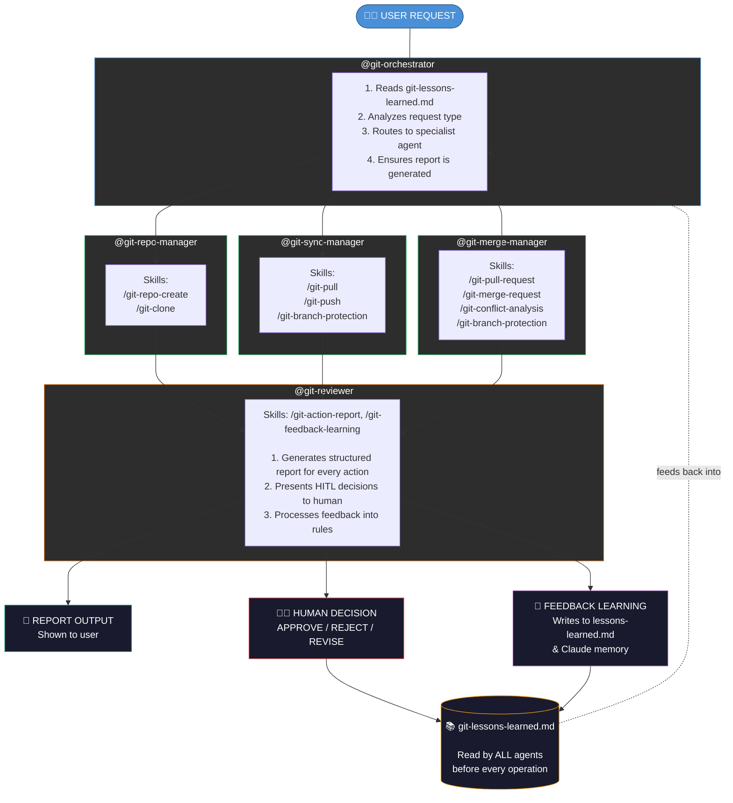
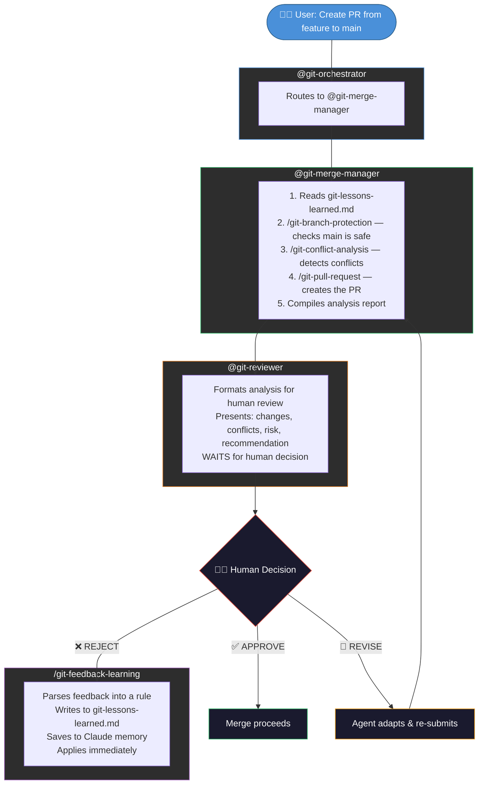

# Multiple AI Agents for GIT Management System

**Author:** Chong Kiat Lim

A multi-agent AI system for managing git operations via MCP (Model Context Protocol). Agents are defined entirely in markdown, with Human-In-The-Loop controls for all critical decisions and a learning system that improves from feedback.

## Architecture

```
.claude/
├── agents/                          # Chat agents (markdown-based AI personas)
│   ├── git-orchestrator.agent.md    # Routes requests to specialist agents
│   ├── git-repo-manager.agent.md    # Repository creation and cloning
│   ├── git-sync-manager.agent.md    # Pull, push, fetch operations
│   ├── git-merge-manager.agent.md   # PRs, MRs, merges, conflict analysis
│   └── git-reviewer.agent.md       # HITL review, reporting, feedback learning
├── skills/                          # Reusable skill workflows
│   ├── git-repo-create/SKILL.md
│   ├── git-clone/SKILL.md
│   ├── git-pull/SKILL.md
│   ├── git-push/SKILL.md
│   ├── git-pull-request/SKILL.md
│   ├── git-merge-request/SKILL.md
│   ├── git-conflict-analysis/SKILL.md
│   ├── git-branch-protection/SKILL.md
│   ├── git-action-report/SKILL.md
│   ├── git-feedback-learning/SKILL.md
│   ├── git-release/SKILL.md
│   └── git-sync-docs/SKILL.md
├── git-lessons-learned.md           # Accumulated rules from human feedback
└── git-report-template.md           # Structured report template
config/                              # Environment and connection configs
docs/                                # Documentation
mcp/                                 # MCP server implementations
tools/                               # CLI tools and scripts
```

## Key Principles

| Principle | Description |
|-----------|-------------|
| **Main branch is sacred** | Always functional. Feature branches adapt to main, never the reverse. |
| **Human-In-The-Loop** | No auto-approvals. Agent provides analysis and recommendations, human decides. |
| **Continuous learning** | Feedback is captured as rules and applied to all future operations. |
| **Full reporting** | Every action produces a structured report with before/after state. |
| **Dual platform** | Supports both GitHub (via MCP) and GitLab (via API). |

## Prerequisites

- Claude Code CLI installed (see [docs/claude-code-installation-usage.md](docs/claude-code-installation-usage.md))
- GitHub MCP server configured (see [docs/mcp-github-server-install-claude.md](docs/mcp-github-server-install-claude.md))
- For GitLab: `GITLAB_PAT` environment variable set in `config/.env`

### Quick MCP Setup

```bash
# Add GitHub MCP server (remote)
claude mcp add-json github '{"type":"http","url":"https://api.githubcopilot.com/mcp","headers":{"Authorization":"Bearer <YOUR_GITHUB_PAT>"}}'

# Verify
claude mcp list
```

## Usage

### Invoke the Git Orchestrator

The main entry point is `@git-orchestrator`. It routes your request to the appropriate specialist:

```bash
# Interactive
claude
> @git-orchestrator create a new private repo called "my-project" on GitHub

# Non-interactive
claude --p "Pull the latest changes from origin/main" --agent git-orchestrator
claude --p "Create a PR from feature-branch to main" --agent git-orchestrator
```

### Invoke Specialist Agents Directly

```bash
claude --p "Clone https://github.com/user/repo" --agent git-repo-manager
claude --p "Push my changes to origin" --agent git-sync-manager
claude --p "Check for conflicts between feature and main" --agent git-merge-manager
```

### Use Skills Directly

In a Claude Code session, invoke skills with the `/` prefix:

```
/git-pull origin main
/git-push origin feature-branch
/git-pull-request feature-branch main
/git-conflict-analysis feature-branch main
```

## Agents

| Agent | Purpose |
|-------|---------|
| `@git-orchestrator` | Main coordinator — routes to the correct specialist agent |
| `@git-repo-manager` | Creates and clones repositories, creates releases (GitHub + GitLab) |
| `@git-sync-manager` | Pulls, pushes, and fetches with safety gates |
| `@git-merge-manager` | Creates PRs/MRs, analyzes conflicts, never auto-approves |
| `@git-reviewer` | Generates reports, presents decisions to human, processes feedback, syncs docs |

## Skills

| Skill | Description |
|-------|-------------|
| `/git-repo-create` | Create a new repository on GitHub or GitLab |
| `/git-clone` | Clone a repository to local filesystem |
| `/git-pull` | Pull changes with safety checks |
| `/git-push` | Push changes with branch protection |
| `/git-pull-request` | Create a GitHub pull request |
| `/git-merge-request` | Create a GitLab merge request |
| `/git-conflict-analysis` | Analyze and classify merge conflicts |
| `/git-branch-protection` | Verify main branch integrity before operations |
| `/git-action-report` | Generate structured action reports |
| `/git-feedback-learning` | Process human feedback into lasting rules |
| `/git-release` | Create releases on GitHub or GitLab with version tags and notes |
| `/git-sync-docs` | Regenerate documentation from current agents and skills (auto-triggered) |

## System Flow Diagram



See [docs/git-agent-system.md](docs/git-agent-system.md) for detailed operation flows and design decisions.

## How It Works

### Flow: Creating a Pull Request



### Learning System

When human feedback is received (rejection, comments, corrections):

1. **Parse**: Extract the core lesson from the feedback
2. **Formulate**: Write a clear WHEN/DO/BECAUSE rule
3. **Store shared**: Append to `.claude/git-lessons-learned.md` (visible to all agents)
4. **Store personal**: Save to Claude memory system (retained across conversations)
5. **Apply**: Use the lesson immediately and in all future operations

Every agent reads `git-lessons-learned.md` before every action.

## Configuration

```bash
# Set up environment
cp config/.env.example config/.env
# Edit config/.env with your tokens
```

### Required Environment Variables

| Variable | Purpose |
|----------|---------|
| `GITHUB_PAT` | GitHub Personal Access Token (for MCP) |
| `GITLAB_PAT` | GitLab Personal Access Token (optional, for GitLab operations) |

## Documentation

- [Git Agent System Architecture & Flows](docs/git-agent-system.md)
- [Claude Code Installation & Usage](docs/claude-code-installation-usage.md)
- [GitHub MCP Server Setup](docs/mcp-github-server-install-claude.md)

## Tech Stack

| Technology / Skill | Description |
|--------------------|-------------|
| Claude Code CLI | AI-powered command-line interface for code generation, editing, and automation |
| MCP (Model Context Protocol) | Standard protocol for connecting AI agents to external tools and services |
| GitHub MCP Server | Remote MCP server providing GitHub API access (repos, PRs, issues, actions) |
| GitLab API | REST API integration for GitLab merge requests and repository management |
| Markdown Agents (.agent.md) | Declarative AI agent definitions using YAML frontmatter and behavioral instructions |
| Skills (SKILL.md) | Reusable workflow procedures that agents invoke for specific operations |
| Multi-Agent Orchestration | Coordinator pattern that routes requests to specialist agents |
| Human-In-The-Loop (HITL) | Decision framework requiring human approval for irreversible operations |
| Conflict Analysis | Automated detection and classification of merge conflicts (trivial/logic/structural) |
| Branch Protection | Pre-merge verification ensuring main branch integrity and functionality |
| Feedback Learning System | Captures human corrections as rules, stored in project files and AI memory |
| Dual-Platform Git Management | Unified workflow supporting both GitHub and GitLab operations |
| Structured Reporting | Template-based action reports with before/after state documentation |
| Git Operations Automation | Automated pull, push, clone, fetch with safety gates and pre-checks |
| Release Management | Create GitHub/GitLab releases with semantic version tags and auto-generated notes |
| Documentation Auto-Sync | Hook-triggered regeneration of project docs when agents or skills change |
| Claude Code Hooks | PostToolUse hooks that inject context back to the model for automated workflows |
