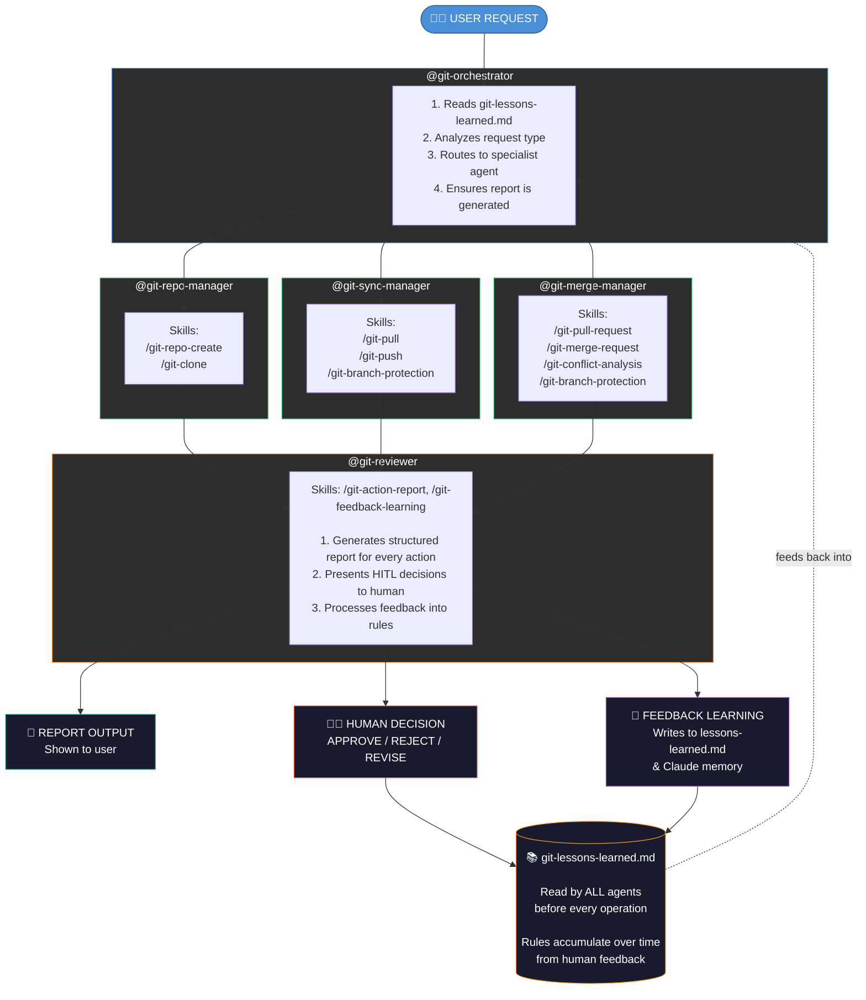
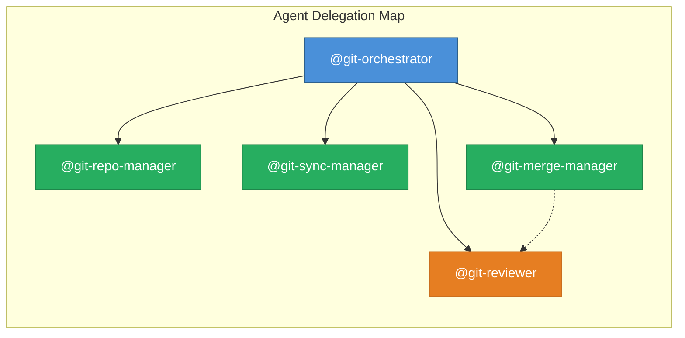
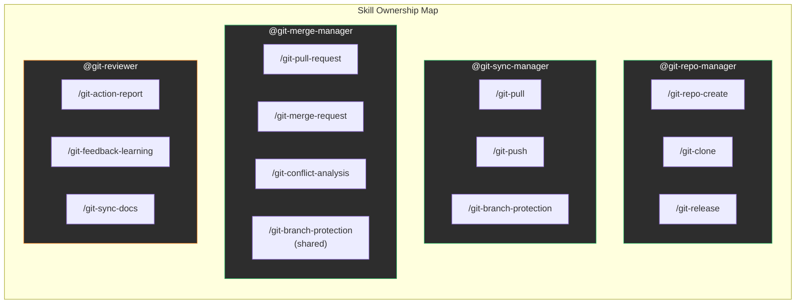
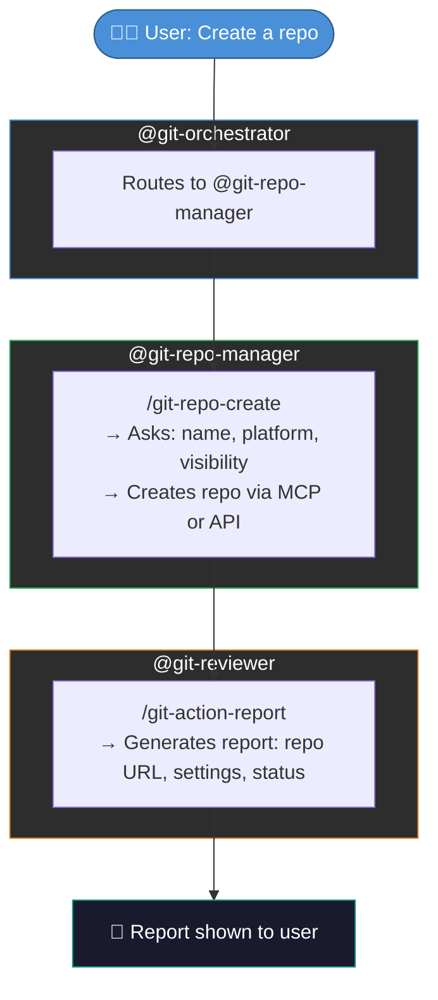
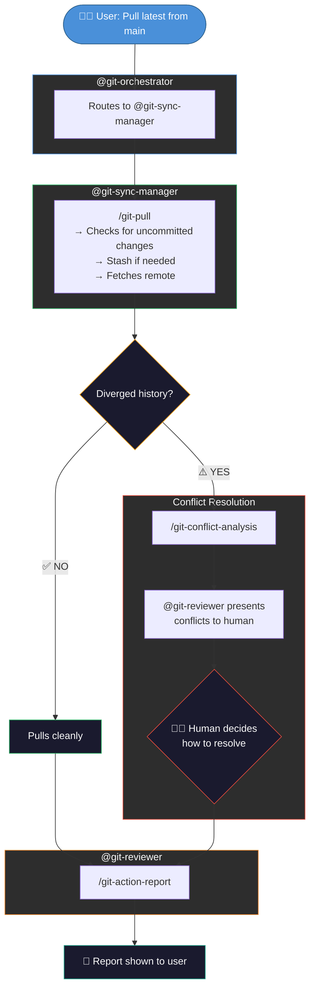
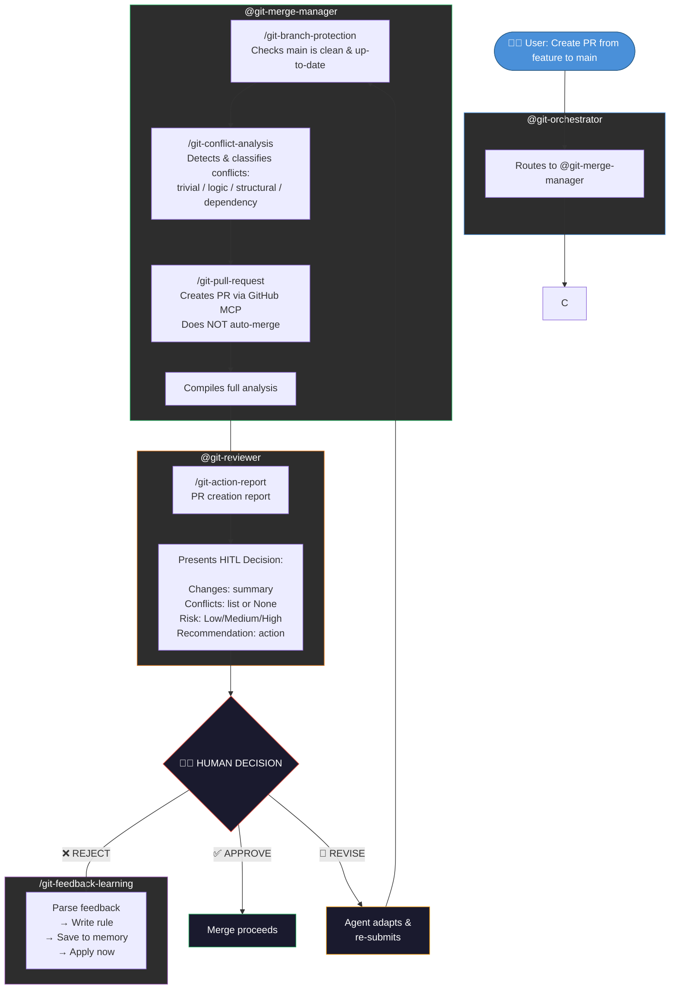
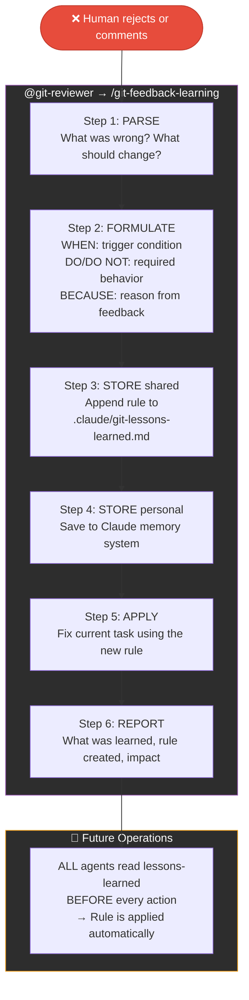

# Git Multi-Agent System Documentation

**Author: Chong Kiat Lim**

## Overview

This document describes the architecture, flow, and relationships of the git multi-agent management system. The system uses 5 markdown-based AI agents and 10 skills to manage the full git lifecycle with Human-In-The-Loop (HITL) controls and continuous learning.

## System Flow Diagram

## Agent Relationships

## Operation Flows

### Flow 1: Repository Creation

### Flow 2: Pull with Conflict Detection

### Flow 3: Pull Request with HITL

### Flow 4: Feedback Learning Cycle

## Shared Resources

| Resource | Path | Purpose |
|----------|------|---------|
| Lessons Learned | `.claude/git-lessons-learned.md` | Accumulated rules from feedback, read by all agents |
| Report Template | `.claude/git-report-template.md` | Structured template for action reports |
| Environment Config | `config/.env` | Tokens (GITHUB_PAT, GITLAB_PAT) |

## Design Decisions

### Why Markdown Agents (Not Code)?

- **Declarative**: Behavior defined as instructions, not imperative code
- **Transparent**: Anyone can read and understand agent behavior
- **Composable**: Skills are reusable across agents without imports
- **Evolvable**: Learning system adds rules without code changes

### Why Human-In-The-Loop?

- **Safety**: Prevents accidental merges that break main
- **Learning**: Every rejection teaches the system something new
- **Trust**: Human retains full control over irreversible actions
- **Audit**: Every decision is documented with reasoning

### Why Dual Storage for Learning?

- **Project file** (`.claude/git-lessons-learned.md`): Shared with team, version-controlled, survives context resets
- **Claude memory**: Personal retention across conversations, survives session boundaries
